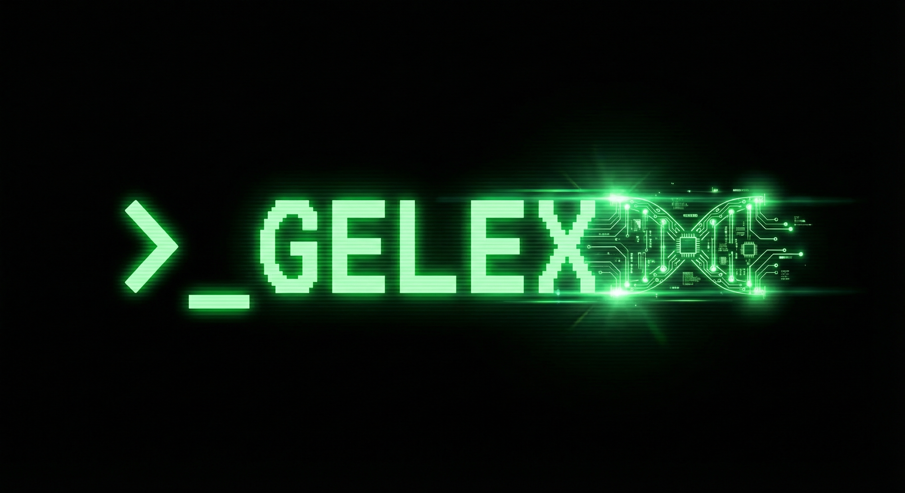

# GELEX: GEnome LEX

[](https://opensource.org/licenses/Apache-2.0)
[](https://gelex.readthedocs.io/en/latest/?badge=latest)
[](https://github.com/r1cheu/gelex/actions/workflows/ci.yml)
[](https://github.com/r1cheu/gelex/releases)
[](https://github.com/r1cheu/gelex/issues)

<p align="center">
  
</p>

Gelex is a high-performance C++ genomic analysis toolkit designed for large-scale genomic prediction and association studies. It integrates advanced Bayesian models (BayesAlphabet series), optimized for memory efficiency and computational speed on massive datasets.

> [!IMPORTANT]
> This project is under active development. APIs and features are subject to change.

## 🌟 Key Features

- **Comprehensive Model Support**:
  - **Bayesian Series**: BayesA, B, C, R, RR and their counterparts for dominance effects (d) and Pi estimation (pi) (14 prior strategies in total).
- **Full-stack Analysis Workflow**:
  - **Model Fitting (`fit`)**: Efficient MCMC sampling.
  - **Genomic Prediction (`predict`)**: Generate predictions for new samples based on trained effect sizes.
  - **Association Testing (`assoc`)**: Mixed linear model GWAS with LOCO (Leave-One-Chromosome-Out) support.
  - **GRM Computation (`grm`)**: Multiple algorithms (Yang, Zeng, Vitezica) for computing Genomic Relationship Matrices.
  - **Phenotype Simulation (`simulate`)**: Simulate complex additive and dominance genetic architectures based on real genotypes.
- **Exceptional Performance**:
  - **Multi-threaded Parallelism**: OpenMP-based parallelization across all modules.
  - **Memory Efficiency**: Memory-mapped BED file reading via `mio` with chunk-based processing support.
  - **Modern Backend**: Powered by the Eigen linear algebra library with MKL or OpenBLAS support.

## 🚀 Installation

Install the latest version via [pixi](https://pixi.sh):

```bash
pixi global install -c conda-forge -c https://prefix.dev/gelex gelex
```

via [Conda](https://docs.conda.io/en/latest/):

```bash
conda install -c conda-forge -c https://prefix.dev/gelex gelex
```

For detailed installation instructions, please visit the [Installation Guide](https://gelex.readthedocs.io/en/latest/installation.html).

## 💡 Quick Start

### 1. Fit a Bayesian Model (BayesR)

```bash
gelex fit \
  --bfile data/genotypes \
  --pheno data/phenotypes.tsv \
  --method R \
  --iters 10000 \
  --burnin 2000 \
  --o result/my_analysis
```

For detailed tutorials on Genomic Prediction, GRM computation, and GWAS, please visit our [Documentation](https://gelex.readthedocs.io).

## 🛠 Development & Testing

Run the full test suite:

```bash
pixi run test
```

For detailed development guidelines (coding style, architecture), please refer to [CLAUDE.md](CLAUDE.md).

## 📄 License

This project is licensed under the [Apache-2.0 LICENSE](LICENSE).

## 📧 Contact & Citation

If you use Gelex in your research, please cite it using the following BibTeX entry:

```bibtex
@misc{gelex,
   author = {RuLei Chen},
   year = {2026},
   note = {https://github.com/r1cheu/gelex},
   title = {Gelex: A high-performance C++ genomic analysis toolkit}
}
```

## 🙏 Acknowledgements

Gelex utilizes several libraries:

- **[Eigen](https://eigen.tuxfamily.org/)**: Eigen is a C++ template library for linear algebra: matrices, vectors, numerical solvers, and related algorithms.
- **[barkeep](https://github.com/proclab/barkeep)**: Small, single C++ header to display async animations, counters, and progress bars.
- **[argparse](https://github.com/p-ranav/argparse)**: Argument parser for modern C++.
- **[mio](https://github.com/mandreyel/mio)**: An easy to use header-only cross-platform C++11 memory mapping library with an MIT license.
