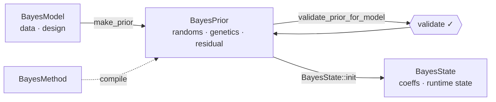
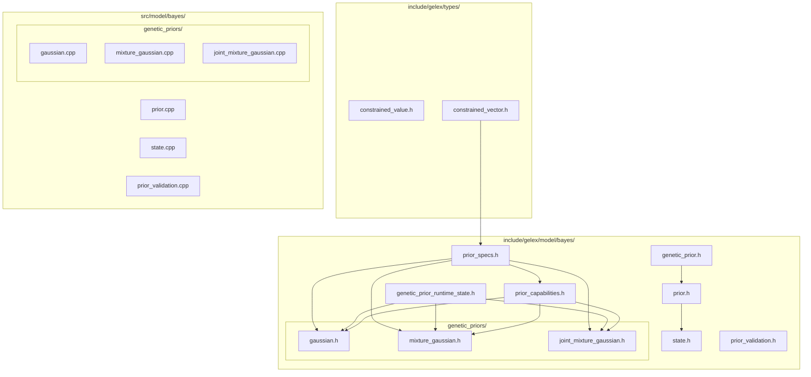
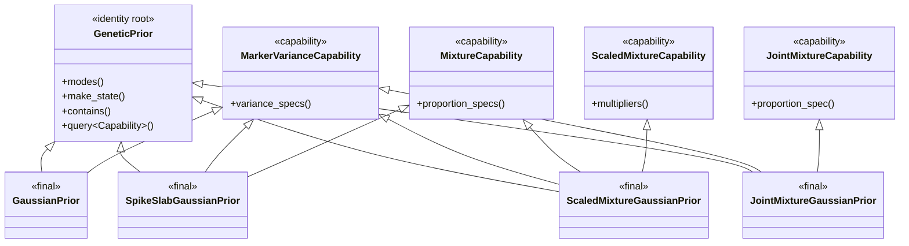
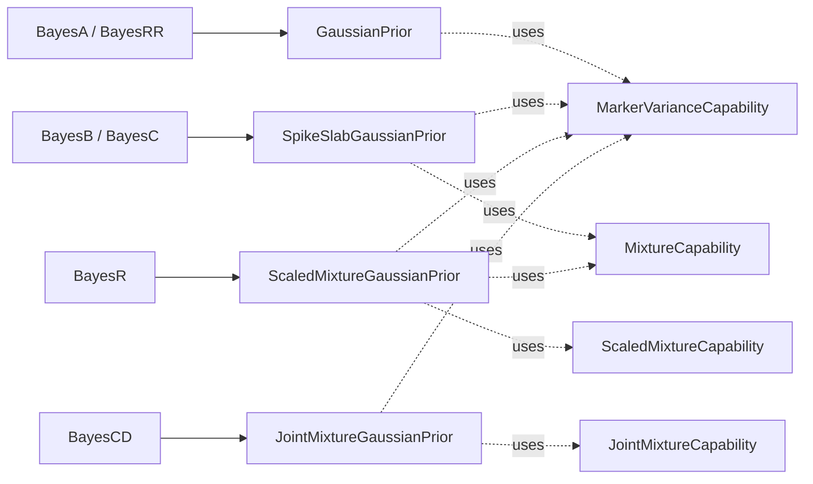
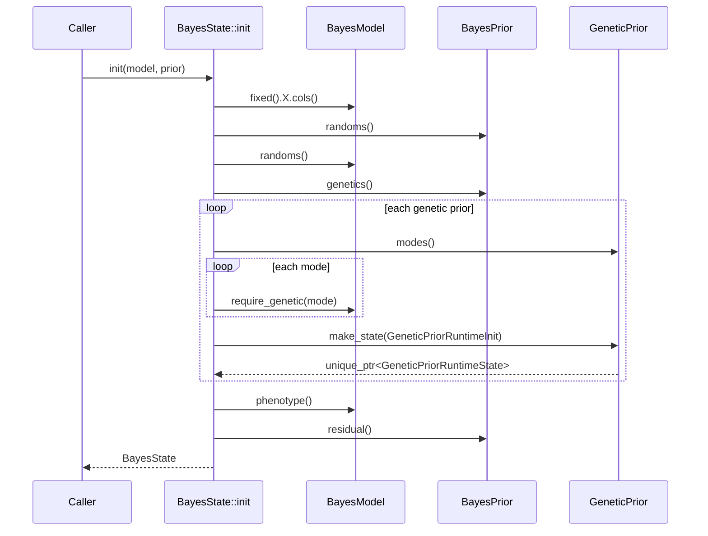

# BayesPrior · Architecture Sheet 02

> `BayesPrior` 是贝叶斯模型的概率契约——它声明结构，不声明算法；
> 它持有超参数，不持有状态。

- Module: `gelex::bayes`
- Status: Beta (breaking ok)
- Requires: `BayesModel`, `BayesMethod`

---

## Topology



**调用顺序：**

```cpp
auto prior = method.make_prior(model);
validate_prior_for_model(model, prior);
auto state = BayesState::init(model, prior);
```

四个核心对象的职责切分：

| 角色 | 类型 | 内容 |
|---|---|---|
| A · Substrate | `BayesModel` | phenotype、fixed/random、genetic effects |
| B · Strategy | `BayesMethod` | 把 method preset 映射为 concrete prior |
| C · Contract | `BayesPrior` | 概率结构、超参数、初始化 contract |
| D · Trajectory | `BayesState` | 当前推断状态 |

`BayesPrior` 不依赖 `BayesMethod`、不创建 MCMC/VI kernel、不暴露 IO schema、
不持有 phenotype/设计矩阵/采样状态。它可被 state 初始化、kernel factory、
samples/checkpoint 读取。

---

## 文件归属



**归属原则：**

- `prior_specs.h` include `gelex/types/constrained_vector.h`，被 capability 头与 concrete prior 共享，不依赖 `BayesPrior`。
- `prior_capabilities.h` 集中所有 capability。pure-virtual 接口无独立编译开销；新增 capability 在此追加。
- `genetic_prior.cpp` 不存在——`GeneticPrior::contains()` 内联于头文件。
- MCMC/VI 的 kernel registry & factory 属于 `algo` 层，与本模块解耦。

---

## 基础值类型

### constrained_value.h / constrained_vector.h

通用 constrained value / vector 基础设施。`ConstrainedVector` 由 `VectorConstraint`
concept 约束，提供 `Simplex` 与 `PositiveVector` 两个语义别名。

```cpp
namespace gelex
{
template <typename C, typename T>
concept VectorConstraint
    = std::floating_point<T> && requires(std::span<const T> values) {
          { C::name } -> std::convertible_to<std::string_view>;
          { C::template check<T>(values) } -> std::same_as<void>;
      };

template <std::floating_point T, typename Constraint>
    requires VectorConstraint<Constraint, T>
class ConstrainedVector { /* ... */ };

template <std::floating_point T>
using Simplex        = ConstrainedVector<T, detail::Simplex>;
template <std::floating_point T>
using PositiveVector = ConstrainedVector<T, detail::Positive>;
}
```

### prior_specs.h

Prior 值类型集合，被 capability 头与 concrete prior 共享。

```cpp
namespace gelex::bayes
{
struct ScaledInvChiSqPrior { double degrees_of_freedom{}; double scale{}; };
struct DirichletPrior      { PositiveVector<double> concentration; };
struct VarianceSpec        { double initial_value{}; ScaledInvChiSqPrior prior; };

enum class MarkerVarianceScope : std::uint8_t { per_marker, per_effect };

class MarkerVarianceSpec
{
   public:
    MarkerVarianceSpec(MarkerVarianceScope scope, VarianceSpec variance);
    auto scope() const -> MarkerVarianceScope;
    auto variance() const -> const VarianceSpec&;
    auto marker_variance_size(Eigen::Index num_markers) const -> Eigen::Index;
};

enum class ProportionUpdate : std::uint8_t { fixed, sampled };

class ProportionSpec
{
   public:
    ProportionSpec(Simplex<double> initial_value,
                   DirichletPrior prior,
                   ProportionUpdate update);
    auto initial_value() const -> const Simplex<double>&;
    auto prior() const -> const DirichletPrior&;
    auto update() const -> ProportionUpdate;
    auto size() const -> std::size_t;
    auto sampled() const -> bool;
};
}
```

**局部 invariant**

1. `ScaledInvChiSqPrior::degrees_of_freedom > 0`
2. `ScaledInvChiSqPrior::scale > 0`
3. `DirichletPrior::concentration` 是 `PositiveVector<double>`
4. `ProportionSpec::initial_value` 是 `Simplex<double>`
5. `concentration.size() == initial_value.size()`
6. `marker_variance_size(N)` 对 `per_marker` 返回 `N`，对 `per_effect` 返回 `1`

---

## GeneticPrior

`include/gelex/model/bayes/genetic_prior.h` 只实现 genetic prior 的稳定接口。
它是 capability query 的 *identity root*。

```cpp
namespace gelex::bayes
{
class GeneticPrior
{
   public:
    auto operator=(const GeneticPrior&) -> GeneticPrior& = delete;
    auto operator=(GeneticPrior&&) noexcept -> GeneticPrior& = delete;

    virtual ~GeneticPrior() = default;

    virtual auto modes() const -> std::span<const GeneticMode> = 0;
    virtual auto make_state(const GeneticPriorRuntimeInit& init) const
        -> std::unique_ptr<GeneticPriorRuntimeState> = 0;

    auto contains(GeneticMode mode) const -> bool;

    template <typename Capability>
    auto query() const -> const Capability*
    {
        return dynamic_cast<const Capability*>(this);
    }

   protected:
    GeneticPrior() = default;
    GeneticPrior(const GeneticPrior&) = default;
    GeneticPrior(GeneticPrior&&) noexcept = default;
};
}
```

> 稳定职责：声明覆盖哪些 effect、创建 runtime state、作为 capability query 的 identity root。

**特殊成员函数规则**

1. public virtual destructor — 允许通过 base pointer 销毁。
2. public deleted copy/move assignment — 禁止 base subobject 切片赋值。
3. protected default constructor — 只有 concrete prior 能构造 base subobject。
4. protected copy/move constructor — concrete prior 自然合成 copy/move。

GeneticPrior 不承担：method name dispatch / kernel 创建 / samples 字段命名 /
CLI / marker variance contract。

---

## Prior Capabilities

不通过中心 `std::variant` 枚举类型，而是通过正交 capability 接口表达能力。

**规则**

1. capability interface **不继承** `GeneticPrior`。
2. capability interface **不持有数据**。
3. 每个 interface 返回自己的领域对象，不要求统一签名。
4. concrete prior 组合继承 `GeneticPrior` + 所需 capability。
5. capability 查询只发生在 validation / kernel factory / writer binding 边界。
6. marker-level hot path 不反复 `dynamic_cast`。
7. public prior contract 不使用 CRTP。

### 继承模型



### genetic_prior_runtime_state.h

Runtime state base 与跨 family 复用的 `MarkerVarianceRuntimeState`。

```cpp
namespace gelex::bayes
{
class GeneticPriorRuntimeState
{
   public:
    auto operator=(const GeneticPriorRuntimeState&)
        -> GeneticPriorRuntimeState& = delete;
    auto operator=(GeneticPriorRuntimeState&&) noexcept
        -> GeneticPriorRuntimeState& = delete;
    virtual ~GeneticPriorRuntimeState() = default;
   protected:
    GeneticPriorRuntimeState() = default;
    GeneticPriorRuntimeState(const GeneticPriorRuntimeState&) = default;
    GeneticPriorRuntimeState(GeneticPriorRuntimeState&&) noexcept = default;
};

class MarkerVarianceRuntimeState
{
   public:
    explicit MarkerVarianceRuntimeState(std::vector<Eigen::VectorXd> variances);
    auto variances()       -> std::span<Eigen::VectorXd>;
    auto variances() const -> std::span<const Eigen::VectorXd>;
    auto variance_at(std::size_t i)       -> Eigen::VectorXd&;
    auto variance_at(std::size_t i) const -> const Eigen::VectorXd&;
   private:
    std::vector<Eigen::VectorXd> variances_;
};

struct GeneticEffectRuntimeInit
{
    GeneticMode mode{};
    Eigen::Index num_markers{};
};

struct GeneticPriorRuntimeInit
{
    std::span<const GeneticEffectRuntimeInit> effects;
};
}
```

**Runtime init contract**

1. `effects` 是当前 `GeneticPrior` block 的初始化视图，不是全模型 genetic effect 列表。
2. `effects.size() == prior.modes().size()`。
3. `effects[i].mode == prior.modes()[i]`，顺序由 `BayesState::init()` 建立。
4. `effects[i].num_markers` 来自对应 `BayesModel::genetic(mode)`，且必须 > 0。
5. `init` 只在 `make_state()` 调用期有效；concrete prior 不保存 span / pointer / reference。
6. `make_state()` 按 index 消费 `init.effects`；不在 concrete prior 内重做全模型 lookup。

| RuntimeState 拥有 | 不属于 RuntimeState |
|---|---|
| marker variance · mixture assignment · sampled proportion · joint marker-level assignment | effect coefficient · genetic value `u` · heritability |

### prior_capabilities.h

```cpp
namespace gelex::bayes
{
class MarkerVarianceCapability
{
   public:
    virtual ~MarkerVarianceCapability() = default;
    virtual auto variance_specs() const
        -> std::span<const MarkerVarianceSpec> = 0;
    // special members omitted
};

class MixtureCapability
{
   public:
    virtual ~MixtureCapability() = default;
    virtual auto proportion_specs() const
        -> std::span<const ProportionSpec> = 0;
};

class ScaledMixtureCapability
{
   public:
    virtual ~ScaledMixtureCapability() = default;
    virtual auto multipliers() const
        -> std::span<const Eigen::VectorXd> = 0;
};

class JointMixtureCapability
{
   public:
    virtual ~JointMixtureCapability() = default;
    virtual auto proportion_spec() const -> const ProportionSpec& = 0;
};
}
```

**Effect-scoped span 对齐契约**

```
prior.modes()[i] <-> marker_variance.variance_specs()[i]
prior.modes()[i] <-> mixture.proportion_specs()[i]
prior.modes()[i] <-> scaled_mixture.multipliers()[i]
```

**为什么不用 CRTP？**

1. `BayesPrior` 持有异构 `std::vector<std::unique_ptr<GeneticPrior>>`。
2. validation / kernel factory / writer binding 需要运行期查询 capability。
3. CRTP 的 capability 信息依赖静态类型，不能直接从 `GeneticPrior&` 查询。
4. `std::variant` 新增类型需修改中心 union。
5. 自建 type-erasure 会重复实现 vtable。

CRTP 只作为 concrete prior 或 kernel 内部 helper，不进入 public prior interface。

边界处显式查询：

```cpp
const auto* marker_variance = prior.template query<MarkerVarianceCapability>();
const auto* mixture          = prior.template query<MixtureCapability>();
```

`query<T>()` 封装的 `dynamic_cast` 只属于 binding/factory 边界，**不**属于
marker-level update loop。

---

## Concrete Genetic Priors

按概率结构分组，不按 BayesA/B/C/R 方法名分组。

**放置规则**

1. concrete prior 不进入 `genetic_prior.h`。
2. concrete runtime state 不进入 `genetic_prior_runtime_state.h`。
3. concrete runtime state 若只服务一个 family，与该 family 放同一 header。
4. method preset 只负责把 BayesA/B/C/R 映射到 concrete prior。
5. 暂不支持的 family 不提前写入 model 层接口。
6. 类型名省略 `Genetic` 前缀——文件路径与继承关系已提供 context。
7. `mixture_gaussian` 仅表示 Gaussian component mixture；non-Gaussian 需新增 family。

### Preset ↔ Prior 映射



| Method Preset | 映射 | 注解 |
|---|---|---|
| BayesA  | `GaussianPrior`               | `per_marker` |
| BayesRR | `GaussianPrior`               | `per_effect` |
| BayesB  | `SpikeSlabGaussianPrior`      | `per_marker` · proportion 长度 2 |
| BayesC  | `SpikeSlabGaussianPrior`      | `per_effect` · proportion 长度 2 |
| BayesR  | `ScaledMixtureGaussianPrior`  | `multipliers[0] == 0.0` |
| BayesCD | `JointMixtureGaussianPrior`   | 覆盖 A / D 两个 mode |

### genetic_priors/gaussian.h

```cpp
namespace gelex::bayes
{
class GaussianPrior final
    : public GeneticPrior,
      public MarkerVarianceCapability
{
   public:
    GaussianPrior(GeneticMode mode, MarkerVarianceSpec variance);
    auto modes() const -> std::span<const GeneticMode> override;
    auto variance_specs() const -> std::span<const MarkerVarianceSpec> override;
    auto make_state(const GeneticPriorRuntimeInit& init) const
        -> std::unique_ptr<GeneticPriorRuntimeState> override;
};

class GaussianRuntimeState final : public GeneticPriorRuntimeState
{
   public:
    explicit GaussianRuntimeState(MarkerVarianceRuntimeState marker_variance);
    auto marker_variance()       -> MarkerVarianceRuntimeState&;
    auto marker_variance() const -> const MarkerVarianceRuntimeState&;
   private:
    MarkerVarianceRuntimeState marker_variance_;
};
}
```

### genetic_priors/mixture_gaussian.h

```cpp
namespace gelex::bayes
{
class MixtureRuntimeState
{
   public:
    MixtureRuntimeState(Eigen::VectorXi assignment,
                        Eigen::VectorXd proportion);
    auto assignment()       -> Eigen::VectorXi&;
    auto assignment() const -> const Eigen::VectorXi&;
    auto proportion()       -> Eigen::VectorXd&;
    auto proportion() const -> const Eigen::VectorXd&;
   private:
    Eigen::VectorXi assignment_;
    Eigen::VectorXd proportion_;
};

class MixtureGaussianRuntimeState final : public GeneticPriorRuntimeState
{
   public:
    MixtureGaussianRuntimeState(MarkerVarianceRuntimeState marker_variance,
                                MixtureRuntimeState mixture);
    auto marker_variance()       -> MarkerVarianceRuntimeState&;
    auto marker_variance() const -> const MarkerVarianceRuntimeState&;
    auto mixture()       -> MixtureRuntimeState&;
    auto mixture() const -> const MixtureRuntimeState&;
   private:
    MarkerVarianceRuntimeState marker_variance_;
    MixtureRuntimeState        mixture_;
};

class SpikeSlabGaussianPrior final
    : public GeneticPrior,
      public MarkerVarianceCapability,
      public MixtureCapability { /* ... */ };

class ScaledMixtureGaussianPrior final
    : public GeneticPrior,
      public MarkerVarianceCapability,
      public MixtureCapability,
      public ScaledMixtureCapability { /* ... */ };
}
```

### genetic_priors/joint_mixture_gaussian.h

`joint_mixture_gaussian.h` **不** include `mixture_gaussian.h`。其 public
interface 只暴露 base `GeneticPriorRuntimeState`；具体 `make_state()` 实现在
`.cpp` 中 include `mixture_gaussian.h` 并构造 `MixtureGaussianRuntimeState`。

```cpp
namespace gelex::bayes
{
class JointMixtureGaussianPrior final
    : public GeneticPrior,
      public MarkerVarianceCapability,
      public JointMixtureCapability
{
   public:
    JointMixtureGaussianPrior(
        std::array<GeneticMode, 2> modes,
        std::array<MarkerVarianceSpec, 2> variances,
        ProportionSpec proportion);

    auto modes() const -> std::span<const GeneticMode> override;
    auto variance_specs() const -> std::span<const MarkerVarianceSpec> override;
    auto proportion_spec() const -> const ProportionSpec& override;
    auto make_state(const GeneticPriorRuntimeInit& init) const
        -> std::unique_ptr<GeneticPriorRuntimeState> override;
};
}
```

JointMixture 要求：覆盖两个不同的 `GeneticMode`；两个 effect 的 marker 数必须
一致；joint mixture assignment 是 *marker-level shared state*；`make_state()`
返回 `MixtureGaussianRuntimeState`；不引入通用 topology container。

---

## BayesPrior

三段聚合：randoms · genetics · residual——move-only 配置对象。

```cpp
namespace gelex::bayes
{
struct RandomEffectPrior
{
    std::string name;
    VarianceSpec variance;
};

class BayesPrior
{
   public:
    BayesPrior(std::vector<RandomEffectPrior> randoms,
               std::vector<std::unique_ptr<GeneticPrior>> genetics,
               VarianceSpec residual);

    BayesPrior(const BayesPrior&) = delete;
    BayesPrior(BayesPrior&&) noexcept = default;

    auto randoms() const -> std::span<const RandomEffectPrior>;
    auto residual() const -> const VarianceSpec&;

    auto genetics() const -> decltype(auto)
    {
        return genetics_ | std::views::transform(
            [](const auto& prior) -> const GeneticPrior& { return *prior; });
    }

    auto random(std::string_view name) const -> const RandomEffectPrior*;

   private:
    std::vector<RandomEffectPrior>                  randoms_;
    std::vector<std::unique_ptr<GeneticPrior>>      genetics_;
    VarianceSpec                                    residual_;
};
}
```

**Constructor invariants**

1. random effect name 唯一。
2. random / residual variance spec 合法。
3. 每个 genetic prior pointer 非空。
4. 每个 genetic prior block 的 `modes()` 非空。
5. genetic mode 在所有 block 中唯一归属。

Concrete prior constructor 负责本地 invariant（class multiplier 长度、mixture
component 数量、joint prior 覆盖的 mode 数量）。`validate_prior_for_model()`
负责 `BayesModel` 与 `BayesPrior` 的跨对象兼容性。

**Genetic traversal contract**

- `genetics()` 是唯一 public genetic block 入口。
- 返回标准 range view；不引入命名 range 类型，不自定义 iterator。
- public contract 只保证可遍历；不承诺 `size()` / `empty()` / random-access。
- 返回 view 非拥有，生命周期不超过所属 `BayesPrior`。
- 遍历顺序等于构造时传入的 block 顺序，也是 `BayesState::init()` 创建 prior runtime state 的顺序。
- range-for 解引用为 `const GeneticPrior&`，不暴露 `std::unique_ptr`。
- `genetic(mode)` / `require_genetic(mode)` / `genetic_block(modes)` 不属于 public API；按 mode 查找与 exact block 匹配仅作为 validation / state binding 的内部 helper。

---

## BayesState 连接

按 prior block 初始化 genetic state；*coeffs* 之外的可变参数全部下沉到
runtime state。

```cpp
namespace gelex::bayes
{
struct FixedEffectState  { Eigen::VectorXd coeffs; };
struct RandomEffectState { Eigen::VectorXd coeffs; double variance{}; };
struct GeneticEffectState{ Eigen::VectorXd coeffs; };
struct ResidualState     { Eigen::VectorXd y_adj; double variance{}; };

class GeneticBlockState
{
   public:
    GeneticBlockState(std::vector<GeneticEffectState> effect_states,
                      std::unique_ptr<GeneticPriorRuntimeState> prior_state);

    auto effect_states()       -> std::span<GeneticEffectState>;
    auto effect_states() const -> std::span<const GeneticEffectState>;
    auto prior_state()       -> GeneticPriorRuntimeState&;
    auto prior_state() const -> const GeneticPriorRuntimeState&;

    template <typename StateT> auto prior_state_as() -> StateT*;
    template <typename StateT> auto prior_state_as() const -> const StateT*;

   private:
    std::vector<GeneticEffectState>             effect_states_;
    std::unique_ptr<GeneticPriorRuntimeState>   prior_state_;
};

class BayesState
{
   public:
    BayesState(FixedEffectState fixed,
               std::vector<RandomEffectState> randoms,
               std::vector<GeneticBlockState> genetics,
               ResidualState residual);

    static auto init(const BayesModel& model, const BayesPrior& prior)
        -> BayesState;

    auto fixed()       -> FixedEffectState&;
    auto fixed() const -> const FixedEffectState&;
    auto randoms()       -> std::span<RandomEffectState>;
    auto randoms() const -> std::span<const RandomEffectState>;
    auto genetics()       -> std::span<GeneticBlockState>;
    auto genetics() const -> std::span<const GeneticBlockState>;
    auto residual()       -> ResidualState&;
    auto residual() const -> const ResidualState&;

   private:
    FixedEffectState fixed_;
    std::vector<RandomEffectState> randoms_;
    std::vector<GeneticBlockState> genetics_;
    ResidualState residual_;
};
}
```

> 由 prior 规格决定的可变参数都属于 `GeneticPriorRuntimeState`——marker
> variance、mixture assignment、sampled proportion。

**Fixed / random / residual contract**

- `FixedEffectState` 只保存 fixed effect coefficients。
- `RandomEffectState` 保存 random effect coefficients 与该 random effect 的 variance。
- `ResidualState` 保存当前 adjusted phenotype `y_adj` 与 residual variance。
- fixed covariate names / random effect name / levels / residual label 不保存在 `BayesState`。
- fixed / random schema 来自 `BayesModel`；random variance prior 与 residual variance prior 来自 `BayesPrior`。

**GeneticBlockState contract**

- `GeneticBlockState` 不保存 `GeneticMode`，也不提供 `effect(mode)` lookup。
- `effect_states()[i]` 与同 block 的 `GeneticPrior::modes()[i]` 同序绑定。
- `prior_state_` 必须非空；`prior_state()` 返回引用，不表达 nullable 语义。
- `prior_state_as<T>()` 是 typed query 语法糖；binding 已确定类型时由 caller assert 非空。
- `BayesState::genetics()[i]` 与 `BayesPrior::genetics()` 遍历序上的第 `i` 个 block 同序绑定。

### init 数据流



```cpp
for (const auto& genetic_prior : prior.genetics())
{
    std::vector<GeneticEffectRuntimeInit> effect_inits;
    std::vector<GeneticEffectState> effect_states;
    for (auto mode : genetic_prior.modes())
    {
        const auto& effect = model.require_genetic(mode);
        effect_inits.push_back({.mode = mode, .num_markers = effect.X.cols()});
        effect_states.push_back({
            .coeffs = Eigen::VectorXd::Zero(effect.X.cols())});
    }
    auto prior_state = genetic_prior.make_state(
        GeneticPriorRuntimeInit{.effects = effect_inits});
    block_states.emplace_back(std::move(effect_states), std::move(prior_state));
}
```

`GeneticPrior::make_state()` 是 mandatory lifecycle interface，**不是** capability。
即使无额外 mixture/joint 结构的 prior，也返回 concrete runtime state——例如
`GaussianRuntimeState` 只持有 marker variance。

log / sample schema / checkpoint path 的 mode 信息来自 `BayesPrior` /
`GeneticPrior::modes()`，不是来自 state：

```cpp
for (auto&& [genetic_prior, block_state] :
     std::views::zip(prior.genetics(), state.genetics()))
{
    for (std::size_t i = 0; i != genetic_prior.modes().size(); ++i)
    {
        const auto mode         = genetic_prior.modes()[i];
        const auto& effect_state = block_state.effect_states()[i];
    }
}
```

---

## 模型兼容性验证

```cpp
namespace gelex::bayes
{
auto validate_prior_for_model(const BayesModel& model,
                              const BayesPrior& prior) -> void;
}
```

**检查项**

1. 每个 model random effect 有对应 random prior。
2. 每个 random prior 匹配一个 model random effect。
3. `BayesState::fixed().coeffs.size() == BayesModel::fixed().X.cols()`。
4. `BayesState::randoms().size() == BayesModel::randoms().size() == BayesPrior::randoms().size()`。
5. `BayesState::randoms()[i].coeffs.size() == BayesModel::randoms()[i].X.cols()`。
6. `BayesState::randoms()[i].variance == BayesPrior::randoms()[i].variance.initial_value` after init。
7. 每个 model genetic effect 归属于一个 genetic prior block。
8. 每个 genetic prior mode 匹配一个 model genetic effect。
9. 一个 `GeneticMode` 只对应一个 model genetic effect。
10. `BayesState::init()` 为每个 prior block 构造 block-local `GeneticPriorRuntimeInit`。
11. `BayesState::genetics()` block 数量等于 `BayesPrior::genetics()` block 数量。
12. `BayesState::genetics()[i]` 与 `BayesPrior::genetics()` 遍历序上的第 `i` 个 block 同序绑定。
13. 同 block 内 `GeneticBlockState::effect_states().size() == GeneticPrior::modes().size()`。
14. `GeneticPriorRuntimeInit::effects.size() == GeneticPrior::modes().size()`。
15. `GeneticPriorRuntimeInit::effects[i].mode == GeneticPrior::modes()[i]`。
16. `GeneticPriorRuntimeInit::effects[i].num_markers > 0`。
17. effect-scoped capability 返回的 span 长度等于 `GeneticPrior::modes().size()`。
18. `modes()[i]` 与 effect-scoped capability 的第 `i` 个元素同序绑定。
19. joint mixture prior 覆盖的 effect 有相同 marker 数。
20. 对实现 `MarkerVarianceCapability` 的 prior，`variance_specs()[i].marker_variance_size(N)` 是 runtime marker variance 的初始化长度。
21. `BayesState::residual().y_adj.size() == BayesModel::phenotype().size()`。
22. `BayesState::residual().variance == BayesPrior::residual().initial_value` after init。

若 validation 需要按 `GeneticMode` 建立索引，只能从 `BayesPrior::genetics()`
临时构建局部 map；该 map 不回写到 `BayesPrior`，也不形成 public lookup API。

---

## Algo 层扩展点

model 层只定义 contract；MCMC / VI factory 在 algo 层。

```cpp
namespace gelex::mcmc
{
class GeneticKernelFactory
{
   public:
    virtual ~GeneticKernelFactory() = default;
    virtual auto supports(const bayes::GeneticPrior& prior) const -> bool = 0;
    virtual auto make(GeneticKernelDeps deps) const
        -> std::unique_ptr<GeneticKernel> = 0;
};

class GeneticKernelRegistry
{
   public:
    auto add(std::unique_ptr<GeneticKernelFactory> factory) -> void;
    auto make(GeneticKernelDeps deps) const -> std::unique_ptr<GeneticKernel>;
};
}
```

| 新增 prior 类型的最小改动 | 无需修改 |
|---|---|
| 新增 concrete `GeneticPrior` | `BayesPrior` |
| 新增必要 capability | `GeneticPrior` base interface |
| 新增 / 复用 concrete `GeneticPriorRuntimeState` | 既有 prior 类型 |
| 新增 MCMC/VI kernel & factory | 既有 kernel |
| 在 registry 注册 factory |  |

---

## 迁移原则

1. `GeneticPrior` 从 method 头文件迁移到 `genetic_prior.h`。
2. `BayesMethod` 只保留 `make_prior(model)`。
3. `BayesState` 初始化只接收 `BayesModel` + `BayesPrior`。
4. `estimate_pi` 只落在 `ProportionSpec::update`。
5. `VarianceScope::per_block` 重命名为 `MarkerVarianceScope::per_effect`。
6. random / residual variance 不携带 marker-only scope。
7. IO 根据 prior/state 的领域事实决定字段，不把 IO 字段名写入 prior。
8. marker variance 从 `GeneticEffectState` 迁移到 `GeneticPriorRuntimeState`。
9. prior 引入的可变状态统一命名为 *runtime state*，不再使用 latent state 表达全部状态。
