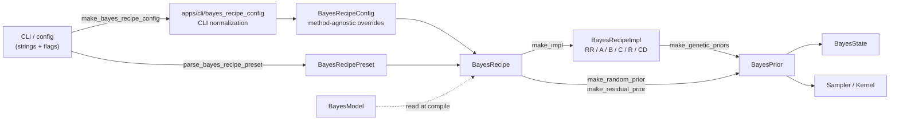
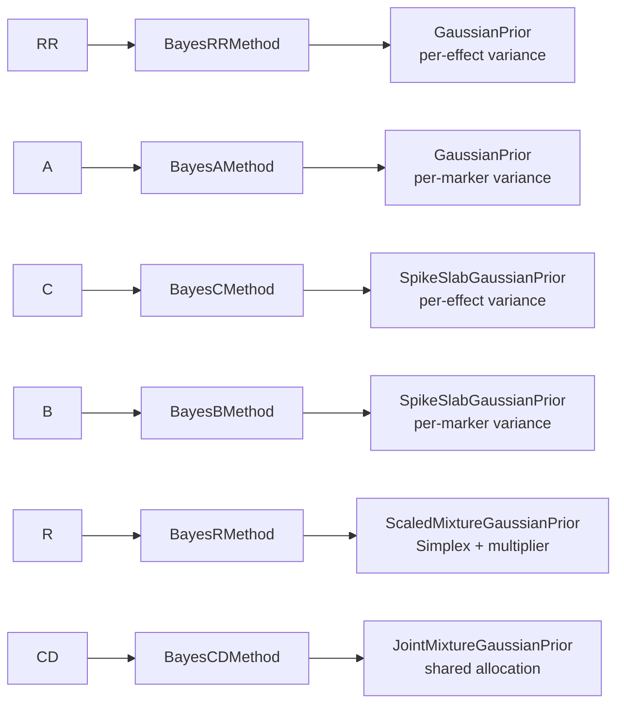

# BayesRecipe · Architecture Sheet 03

> `BayesRecipe` 是用户选择的命名方法。它不承载数据、不承载状态、不调度算法；
> 它只把 preset、用户 override 与 `BayesModel` 编译成 `BayesPrior`。

- Module: `gelex::bayes`
- Status: Draft / Beta (breaking ok)
- Requires: `BayesModel`, `BayesPrior`

---

## Topology



**唯一编译点：** `BayesRecipe::make_prior(model)`。Preset → Concrete impl → Prior 在此一次性完成；
下游 sampler/state/log 只依赖 `BayesPrior` capability，不再读 preset 名字。

---

## Truth ownership

| Truth | Owner | Shape |
|---|---|---|
| CLI syntax | `apps/cli/*_args.cpp` | flag names, aliases, arity, parser defaults |
| User overrides | `BayesRecipeConfig` | method-agnostic override slots |
| Named method topology | concrete `BayesRecipeImpl` | independent / joint / allocation semantics |
| Final probabilistic contract | `BayesPrior` | `GeneticPrior`, `VarianceSpec`, `ProportionSpec`, multiplier |

`BayesRecipeConfig` **不拥有 method topology**。它只记录用户提供了哪些 override；
`RR/A/B/C/R/CD` 如何解释这些 override，只属于 concrete recipe compile step。

`BayesPrior` 是编译结果，不是第二份 method truth。它可以含有 joint / independent
结构，因为这是 sampler/state 的消费合同。

同一份 truth 不能在 CLI、config、recipe 三层重复维护。CLI flag 必须一对一映射到
config slot；短 flag 可以作为 canonical API，但不能依赖 preset 才能解释。例如 `--pi`
固定映射到 additive proportion，`--dpi` 固定映射到 dominance proportion。

---

## Preset ↔ Prior 映射



Preset 是 `enum class BayesRecipePreset : uint8_t { RR, A, B, C, R, CD }`；
CLI 名字 (`BayesRR`, `BayesA`, …) 在 `parse_bayes_recipe_preset()` ingress 处映射。
CD 由 `BayesCDMethod` 编译为 `JointMixtureGaussianPrior`，共享 A / D allocation。

新增 concrete prior **不**修改 `BayesRecipe`。
新增命名方法**才**扩展 `BayesRecipePreset` + concrete method + `make_impl()` 入口分支。

---

## CLI ingress

目标文件：

- `apps/cli/bayes_recipe_config.h`
- `apps/cli/bayes_recipe_config.cpp`

接口：

```cpp
namespace cli
{
auto make_bayes_recipe_config(const CLI::App& cmd)
    -> bayes::BayesRecipeConfig;
}
```

调用点：

```cpp
auto preset = bayes::parse_bayes_recipe_preset(
    cmd.get_option("-m")->as<std::string>());
auto config = cli::make_bayes_recipe_config(cmd);
auto recipe = bayes::BayesRecipe{preset, std::move(config)};
```

职责：

1. 读取 CLI parser state，构造 method-agnostic `BayesRecipeConfig`。
2. 保留 omission 语义：用户没写的 Bayes override 保持 `std::nullopt`。
3. 只拒绝无法无损映射到 `BayesRecipeConfig` 的 CLI shape。
4. 不读取 `BayesModel`，不计算 marker variance，不填 method-specific defaults，
   不构造 `BayesPrior`，不做 method topology / compatibility check。

放在 `apps/cli`，不放进 `include/gelex/` 或 `src/model/bayes/`。原因是 translator
依赖 `CLI::App`、flag 名称、alias、`Option::count()` 和 CLI
错误文案；这些是 ingress 语法，不是 Bayes public API。

不需要 `BayesRecipeConfigBuilder` class。当前没有生命周期、共享状态或多阶段不变量；
`BayesRecipeConfig` 本身是 owning value，translator 用 free function 即可。

映射：

| CLI input | `BayesRecipeConfig` output |
|---|---|
| `--mode A/D/AD` | `modes` |
| `--h2` | `additive.heritability` |
| `--d2` | `dominance.heritability` |
| `--pi` | `additive.proportion` |
| `--dpi` | `dominance.proportion` |
| `--scale` | `additive.multiplier` |
| `--dscale` | `dominance.multiplier` |
| `--jpi` | `joint_proportion` |
| `--sample-pi` | `additive.proportion_update` |
| `--sample-dpi` | `dominance.proportion_update` |
| `--sample-jpi` | `joint_proportion_update` |
| `--dom-pos-prob` | `dominance_positive_probability` |
| `--random-pve` | `random_variance_proportion` |

`--sample-*-pi` 可以在没有显式 simplex 时生效，因为它一对一映射到对应
`proportion_update` slot；concrete recipe 决定该 update override 是否支持。

effect-specific override 必须与 `--mode` 自洽：未请求 `A` 时拒绝 `--h2`、`--pi`、
`--scale`、`--sample-pi`；未请求 `D` 时拒绝 `--d2`、`--dpi`、`--dscale`、
`--sample-dpi`、`--dom-pos-prob`。这是 CLI shape 检查，不读取 model，也不判断
recipe topology。

canonical flag 若已经暴露但无法无损映射到 `BayesRecipeConfig`，必须在 translator
拒绝，不能 accepted-but-ignored。当前 canonical flags 都有对应 slot；迁移期 legacy
flags 由 legacy config path 消费，不属于 `make_bayes_recipe_config` 的判断范围。

BayesR 的 proportion 与 multiplier 是否必须成对、B / C 是否只接受 proportion、
RR / A 是否拒绝 mixture override，全部属于 concrete recipe 的 compatibility check。
translator 不用 `preset` 重复这些规则。

如果当前 `BayesRecipeConfig` 尚未表达某个 canonical CLI flag 对应的 slot，该 flag
不得暴露。迁移期旧 flag 若已暴露但无法无损映射，必须显式拒绝，不能 accepted-but-ignored。

---

## 用户可见类型

| 代码名 | 对应概念 |
|---|---|
| `BayesRecipeConfig` | 用户 override 总入口，不表达 method topology |
| `std::vector<GeneticMode>` | requested genetic modes；只允许 `{A}` / `{D}` / `{A, D}` |
| `EffectConfig` | 单 effect override：heritability / proportion / multiplier / proportion update |
| `OpenUnitInterval` | scalar override in `(0, 1)` |
| `Simplex` | proportion override |
| `ScaleMultiplier` | multiplier override |
| `joint_proportion` | optional joint allocation override |
| `joint_proportion_update` | optional joint allocation update override |
| `dominance_positive_probability` | optional dominance sign probability override in `(0, 1)` |

---

## 不变量（代码补不上的部分）

1. **边界** — `BayesRecipe` 不持有 phenotype / 设计矩阵 / marker 数 / runtime state / `BayesPrior`，
   不创建 sampler / kernel / checkpoint / log schema，不作为 downstream dispatch 依据。
2. **唯一真相源** — method topology 只由 concrete recipe 拥有；
   final probabilistic source of truth 是 `BayesPrior` 内的 `ProportionSpec` /
   `MarkerVarianceSpec` / multiplier。`BayesRecipeConfig` 不接受 `VarianceSpec` /
   arbitrary prior override；需完全自定义结构时直接构造 `BayesPrior`。
3. **Config shape** — `BayesRecipeConfig` 是 method-agnostic override bag；
   不使用 `variant<IndependentEffects, JointEffects>` 表达 independent / joint 互斥。
   不使用 method-specific wrapper / variant 表达 pair constraints。
   互斥与成对要求由 concrete recipe 消费 config 时决定。
4. **顺序绑定** — single-effect preset 按 canonical genetic mode order 生成 block，
   当前为 A 后 D（见 `IndependentMethod::for_each_effect`）。
   `BayesModel` 侧需要保持同一 canonical order 以保证 `BayesPrior::genetics()` /
   `BayesState::genetics()` 的绑定顺序一致。
   Design note：未来若 `BayesModel::genetics()` 变为真实 source of truth，
   需将 `IndependentMethod::for_each_effect` 改为 model-driven。
5. **Optional 语义** — config 内部 optional 只表示用户未 override；
   不表示 topology presence。
   override 缺省由 concrete method 私有 helper 或 `BayesRecipe` helper 填充，
   不引入 `ResolvedInit` 中间包装。
6. **失败模式** — config constructor 校验局部 shape / numeric invariant；
   method-specific compatibility 在 concrete method 消费 config 时抛
   `GelexException`。`make_prior()` 不返回 partially valid prior。
7. **Ingress 分离** — CLI translator 只负责 CLI 语法到 `BayesRecipeConfig`
   的归一化。Parser UX default 可以留在 CLI；Bayes semantic default 留在
   concrete recipe compile layer。

---

## GCTB-style defaults

| Knob | Default | Note |
|---|---|---|
| proportion update | method-defined | `nullopt` 走 concrete method 默认 |
| BayesB/C `Simplex` | `{0.99, 0.01}` | concrete method default |
| BayesR `Simplex` | `{0.99, 0.005, 0.003, 0.001, 0.001}` | 五个分量 |
| BayesR `multiplier` | `{0.0, 0.001, 0.01, 0.1, 1.0}` | 对应五个分量 |
| additive heritability | `0.5` | |
| dominance heritability | `0.2` | |
| `random_variance_proportion` | `0.05` | non-SNP random effect；用户 override 必须在 `(0, 1)` |

---

## Flat variance prior sentinel

`BayesPrior` 的 `VarianceSpec.prior` 接收两类合法形态：

- **proper prior**: `degrees_of_freedom > 0 && scale > 0`
- **flat prior sentinel**: `degrees_of_freedom == -2 && scale == 0`

flat sentinel 由 `BayesRecipe::make_random_prior()` 和 `BayesRecipe::make_residual_prior()` 统一生成，
表示"estimate from data without informative prior"。数学前提 `n > 2` 由调用侧（compile layer）保证，
`BayesPrior` 不做此项检查。

---

## Migration

1. 实现新 `BayesRecipePreset` / `BayesRecipeConfig` / `make_prior(model)` contract。
2. 删除 downstream 对 preset 名字的 kernel/state/log 分支依赖。
3. 将 `BayesRecipeConfig` 从 topology variant 改为 method-agnostic override bag。
4. 将 canonical CLI flag 改为一对一映射 config slot；旧 context-sensitive flag 只作为
   compatibility translator 存在。
5. 将 config 中的 per-effect mixture variant 拆成 raw override slots，由 concrete recipe
   处理 method-specific pair constraints。
6. 新增 `apps/cli/bayes_recipe_config.{h,cpp}`，让 MCMC / VI CLI 通过它生成
   `BayesRecipeConfig`。
7. Legacy parser 只作为迁移桥，逐步移除旧 config 类型与 post-hoc overrides。
8. 不为旧测试扩大 API；测试调用点按新 contract 修正。
